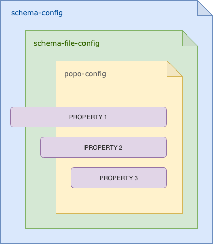

# POPO

POPO - "Plain Old Php Object" was inspired by "Plain Old Java Object" (POJO) concept.

POPO generator can also locate, load, validate, and combine POPO schemas to create PHP source code files, representing
Data Structures / Data Transfer Objects.

The schema supports inheritance, collections and encapsulation of other POPO objects.

### Example

Simple schema in YAML format, describing properties and relations of POPO objects.

In this case, `Foo` defines `Bar` as its property, and they are both defined under `Example` schema name.

```yaml
$:
  config:
    namespace: App\Example\Readme
    outputPath: tests/

Example:
  Foo:
    property: [
      {name: title}
      {name: bar, type: popo, default: Bar::class}
    ]}}

  Bar:
    property: [
      {name: title}
    ]}}
```

#### Instantiate hierarchy of objects from an array.

```php
use App\Example\Readme\Foo;

$data = [
    'title' => 'A title',
    'bar' => [
        'title' => 'Bar lorem ipsum',
    ],
];

$foo = (new Foo)->fromArray($data);

echo $foo->getTitle();
echo $foo->getBar()->getTitle();
```

Output:

```
A title
Bar lorem ipsum
```

#### Display hierarchy of objects as an array.

```php
use App\Example\Readme\Foo;

$foo = (new Foo);
$foo->requireBar()->setTitle('new value');

print_r($foo->toArray());
```

Output:

```
[
    'title' => null,
    'bar' => [
        'title' => 'new value',
    ],
];
```

_Run `bin/popo generate -s tests/fixtures/popo-readme.yml` or `docker-popo generate -s tests/fixtures/popo-readme.yml` to generate files from this example._

### getter vs requester

The method `requireBar()` automatically creates instance of Bar in case where the value has not been set yet, while the
method `getBar()` simply returns Bar's property value.

## Installation

```sh
composer require popo/generator --dev
```

Note: The installation can be skipped when using docker, see _Docker support_ section.

## Usage

You can either use it as composer dependency or as docker command.

### Generate command

1. Define schema file, see [tests/fixtures](tests/fixtures/) for examples.

2. Generate POPO files, run:
   - with composer
   
      ```sh
      vendor/bin/popo generate -s <schema-path> \
        -c [schema-config-filename] \
        -o [output-path] \
        -nm [namespace] \
        -nr [namespace-root] \
        -p [schema-path-filter] \
        -m [schema-filename-mask]
      ```
   - with docker
      ```sh
      docker-popo generate -s <schema-path> \
        -c [schema-config-filename] \
        -o [output-path] \
        -nm [namespace] \
        -nr [namespace-root] \
        -p [schema-path-filter] \
        -m [schema-filename-mask]     
     ```
   

_For example: `bin/popo generate -s tests/fixtures/popo.yml` or `docker-popo generate -s tests/fixtures/popo.yml`._

## Command line arguments

### `<schema-path>`

This parameter can either be a path to YAML file, or to a directory, under where YAML configuration files are stored.

This parameter is required.

_Note:_ To provide multiple values use comma as a separator, eg. `s tests/bundles/,tests/projects/`.

### `[schema-config-filename]`

This parameter is optional, but when set a shared schema configuration will be used for all POPO schemas.

### `[output-path]`

Output path where the files will be generated, the namespace folders will be created automatically.

This parameter is optional, but when set it overrides `outputPath` configured in a schema.

### `[namespace]`

Namespace of generated POPO files.

This parameter is optional, but when set it overrides `namespace` configured in a schema.

### `[namespace-root]`

This parameter is optional, but when set it allow set mapping between `namespace` and `outputPath`.

For example, the configuration below would remove `ExampleBundle` from the file path, when generating files
under `outputPath` directory.

```yaml
 namespace: ExampleBundle\AppWithNamespaceRoot\Example
 namespaceRoot: ExampleBundle
```

### `[schema-path-filter]`

Additional path filter when `schema-path` is set to a folder.

This parameter is optional.

Each schema folder can contain multiple schema files, for example:

```
<bundles>
    |
    |-- <example-foo>
    |         |_ foo.popo.yml
    |         
    |-- <example-bar>
    |         |- bar.popo.yml   
    |         |_ buzz.popo.yml   
    |
    |-- global.config.yml
```

_Run `bin/popo generate -s tests/fixtures/ -p bundles -c tests/fixtures/bundles/project.config.yml` or `docker-popo generate -s tests/fixtures/ -p bundles -c tests/fixtures/bundles/project.config.yml` to generate files from this example._


### `[schema-filename-mask]`

Filename mask used to locate schema files when using `schema-path-filter`.

Default is `*.popo.yml`.


### Report Command

The `report` command shows list of defined / inherited properties.

```sh
vendor/bin/popo report -s <schema-path> \
  -c [schema-config-filename] \
  -p [schema-path-filter]
```

For example, report for `tests/fixtures/popo-readme.yml` file. 

```
bar
 popo-config Example::Foo - tests/fixtures/popo-readme.yml
title
 popo-config Example::Bar - tests/fixtures/popo-readme.yml
 popo-config Example::Foo - tests/fixtures/popo-readme.yml
```

_Run `bin/popo report -s tests/fixtures/popo-readme.yml` or `docker-popo report -s tests/fixtures/popo-readme.yml` to generate files from this example._


## POPO Schema

```yaml
$: # file-config
  config:
    namespace: string
    outputPath: string
    namespaceRoot: string|null # if set remaps namespace and outputPath
    extend: string|null # which class POPO objects should extend from
    implement: string|null # which interface POPO objects should implement
    comment: string|null # Class docblock comment
  default: array # default values
  property: array #shared properties

SchemaName: # schema-config
  $: # shared configuration for all POPO objects in SchemaName
    config:
      namespace: string
      outputPath: string
      namespaceRoot: string|null
      extend: string|null
      implement: string|null
      comment: string|null
    default: array
    property: [{
      name: string
      type: 
        type: string
        default: string
        supportedTypes: ['array','bool','float','int','string','mixed','const','popo']
      comment: string|null # Property docblock comment
      default: mixed # default value
      itemType: string|null # collection item type
      itemName: string|null # collection item singular name
    }]

  PopoName: # popo-config
    config:
      namespace: string
      outputPath: string
      namespaceRoot: string|null
      extend: string|null
      implement: string|null
      comment: string|null
    default: array
    property: [{
      name: string
      type:
        type: string
        default: string
        supportedTypes: ['array','bool','float','int','string','mixed','const','popo']
      comment: string|null
      default: mixed
      itemType: string|null
      itemName: string|null
    }]
```

POPO Schema can be defined and extended on few levels, and it can be defined in multiple files.

The `popo-config` values override `schema-config` values, and `schema-config` values overwrite `file-config` values.

On top of that, there is a `global-config` that is defined when using `--schemaConfigFilename` parameter.



### `file-config` 

The configuration was defined as a `SchemaFile` property.
It will be used by all POPO objects in _current_ file.


### `schema-config`

The configuration was defined as a `Schema` property.
It will be used by all POPO objects in _all_ files, under given schema.


### `popo-config`

The configuration was defined as a POPO property.
It will be used by one specific POPO objects in _current_ file, under given schema.


See [tests/fixtures](tests/fixtures/) for schema examples.

### Property type list

- `array`
- `bool`
- `float`
- `int`
- `string`
- `mixed`
- `const`
- `popo`

### Additional methods

Apart from the typical setters and getters POPO objects have additional helper methods which ease access to, and offer
more insight about the data that they represent.

The following methods are supported:

- `isNew`
- `fromArray`
- `toArray`
- `requireAll`
- `listModifiedProperties`

Property specific methods:

- `set`
- `get`
- `require`
- `has`
- `addCollectionItem`

### Collection support

Use property's `itemType` and `itemName` to create properties with collection item type support. For example
using `Buzz::class` as itemType and `buzz` for the itemName, would generate: `addBuzz(Buzz $item)`.

#### More Examples

See [fixtures](tests/fixtures/popo.yml) and [tests](tests/suite/App/PopoTest.php) for more usage examples.

### PHP version compatibility

- POPO `v1.x` - PHP 7.2+
- POPO `v2.x` - PHP 7.2+
- POPO `v3.x` - PHP 7.4+
- POPO `v4.x` - PHP 8+
- POPO `v5.x` - PHP 8+

### Composer script

Add popo scrip to composer and run `composer popo` in a project.

```
    "scripts": {
        "popo": [
            "bin/popo generate -s <schema-path>"
        ]
    },
    "scripts-descriptions": {
        "popo": "Generate POPO files"
    }
```

### Docker support

With docker you can generate files without installing `POPO` as dependency in the project.

```
docker container run -it --rm  -v "$(pwd):/popo/" -w/popo oliwierptak/popo /popo-app/bin/popo
```

You can either run the command directly, or create an alias, e.g.:

```
alias docker-popo='docker container run -it --rm  -v "$(pwd):/popo/" -w/popo oliwierptak/popo /popo-app/bin/popo ${@}'
```

For example:

```
docker-popo generate -s tests/fixtures/popo.yml
docker-popo report -s tests/fixtures/popo.yml
``` 

See also: [bin/docker-popo](bin/docker-popo).
